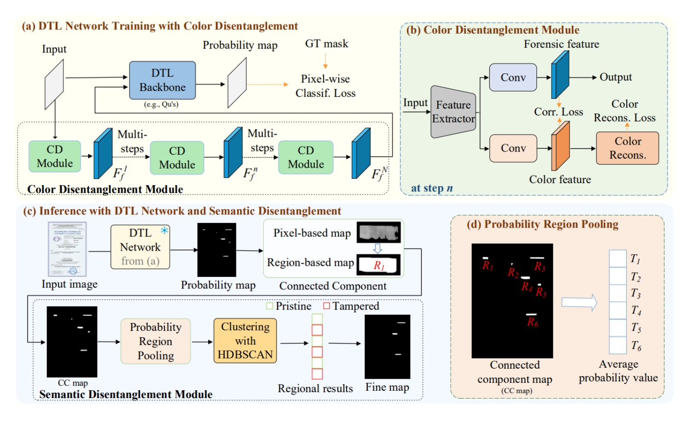

# Generalized Document Tampering Localization via Color and Semantic Disentanglement  
# 基于颜色与语义解耦的文档篡改定位方法

**2025-09-25: Code is already public**  
**2025-09-25: 代码已公开**  

## 项目结构 / Project Structure
```
DTL_CDSD/
├── code/                           # 主要代码目录
│   ├── dtd.py                      # 核心模型定义文件
│   ├── dtdtrain_CD.py              # CD训练脚本
│   ├── dtdEval.py                  # CD评估脚本
│   ├── dtdEval_npy_ours.py         # 用于输出npy，供SD模块使用
│   ├── data_loader.py              # 数据加载器
│   ├── fph.py                      # 频率感知头(Frequency Perception Head)
│   ├── swins.py                    # Swin Transformer实现
│   ├── losses/                     # 损失函数模块
│   │   ├── __init__.py
│   │   ├── lovasz.py               # Lovász损失
│   │   ├── soft_ce.py              # 软交叉熵损失
│   │   └── ...                     # 其他损失函数
│   ├── SD_Semantic_Disentanglement/ # 语义解离模块
│   │   ├── 3_npy_clustering.py     # SD聚类工具
│   │   └── mdb_json/               # 元数据JSON文件
│   ├── checkpoint/                 # 模型检查点
│   │   └── model_load/             # 预训练模型
│   ├── pks/                        # 量化表数据
│   └── tool/                       # 工具文件
│       └── DTD_MedianColor.json   # 中值颜色配置
└── qt_table.pk                     # 量化表文件
```

---

## 📖 Overview | 项目概述  
This repository contains the official implementation of the paper:  
**Generalized Document Tampering Localization via Color and Semantic Disentanglement**  
本仓库为论文 **[基于颜色与语义解耦的文档篡改定位方法](https://ieeexplore.ieee.org/document/11122522)** 的官方实现代码。

### Core Innovations | 核心创新

We propose a knowledge-guided disentanglement representation learning method that separates color information from forensic features through explicit utilization of document color as supervision signals, improving generalization performance across different document types. Additionally, we introduce semantic disentanglement by applying global clustering to tampering probability maps, emphasizing tampering probabilities while ignoring local semantic details, enabling effective adaptation to diverse and flexible tampering operations without additional training.

我们提出了一种知识引导的解耦表示学习方法，通过显式利用文档颜色作为监督信号将颜色信息从篡改特征中分离出来，提高了在不同类型文档上的泛化性能。同时，我们通过将全局聚类应用于篡改概率图来实现语义解耦，强调篡改概率而忽略局部语义细节，能够有效适应文档图像中篡改操作的多样性和灵活性，无需额外训练。

---

## 🚀 Features | 核心特点  
- **Color Disentanglement**: To address the issue of background color interference in document tampering localization tasks, we introduce explicit disentanglement of color and forensic features.
- **Semantic Disentanglement**: To alleviate misjudgment problems caused by semantic feature dependency, the core idea is to model the tampering probability distribution as the primary target, rather than relying on features containing semantic information.

- **颜色解耦**: 针对文档图像篡改定位任务中易受背景颜色干扰的问题，引入显式的颜色与取证特征解耦。
- **语义解耦**: 缓解语义特征依赖所引发的误判问题，其核心思路是以篡改概率分布为主要建模对象，而非依赖包含语义的特征。


---

## 🛠️ Technical Overview | 技术框架  


---


## 📚 Citation | 引用  
```bibtex
@ARTICLE{11122522,
  author={Zheng, Shiqiang and Chen, Changsheng and Chen, Shen and Yao, Taiping and Ding, Shouhong and Li, Bin and Huang, Jiwu},
  journal={IEEE Transactions on Circuits and Systems for Video Technology}, 
  title={Generalized Document Tampering Localization via Color and Semantic Disentanglement}, 
  year={2025},
  volume={},
  number={},
  pages={1-1},
  keywords={Semantics;Image color analysis;Feature extraction;Location awareness;Videos;Robustness;Disentangled representation learning;Circuits and systems;Training;Image forensics;Document tampering localization;Feature disentanglement;Image manipulation detection;Image forensics;Semantic segmentation},
  doi={10.1109/TCSVT.2025.3597602}}
